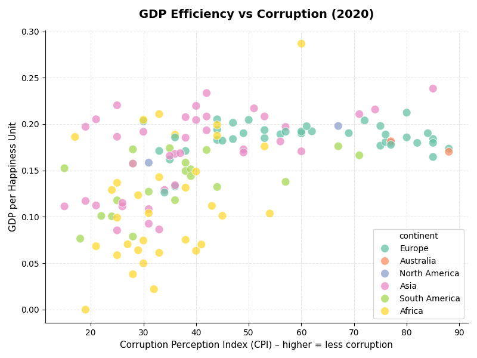
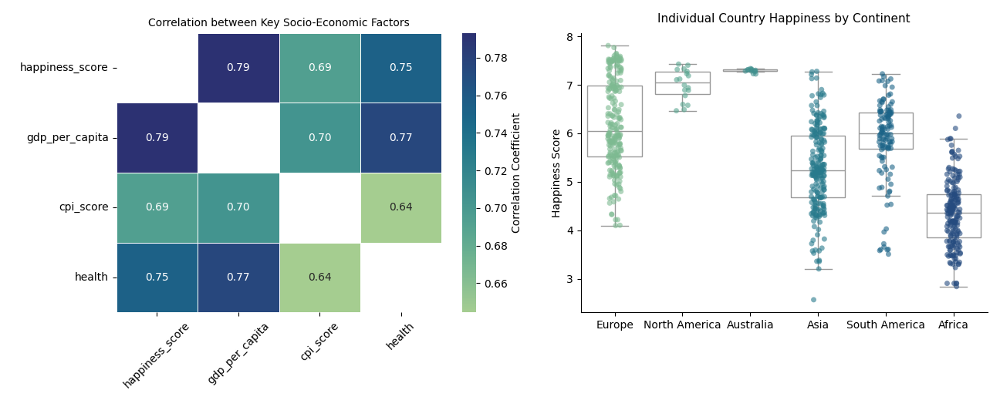

# World Happiness Data Analysis (2015–2020)

A data-driven exploration of how **happiness, corruption, GDP, and health** interact across continents between 2015 and 2020.  
This project highlights the **core stages of data work** cleaning, analysis, and visualization.

---

## Project Overview

**Goal:**  
Understand how **economic performance, corruption (CPI)**, and **health** influence global happiness levels.

**Dataset:**  
[World Happiness & Corruption Index *(2015–2020)](https://www.kaggle.com/datasets/eliasturk/world-happiness-based-on-cpi-20152020)  

**Tools & Libraries:**  
`Python` · `pandas` · `NumPy` · `Seaborn` · `Matplotlib`

**Focus Areas:**  
- Exploratory Data Analysis (EDA)  
- Feature selection and cleaning  
- Visual storytelling with data  

---

## Visual Insights

### GDP Efficiency vs Corruption (2020 Snapshot)

  

Each point represents a country.  
Higher CPI → *less corruption*.  
Countries with **lower corruption** often achieve **better GDP efficiency per happiness unit**,  
though the pattern is less stable in developing regions.

---
### Correlation between Key Socio-Economic Factors and Happiness

  

**Key Takeaways:**  
- **Happiness** shows strong correlation with **GDP per capita** and **health**  
- **Corruption (CPI)** maintains a consistent link to overall well-being  
- Strong economies tend to exhibit higher health scores and perceived happiness

---

## Analytical Insights

| Observation | Insight |
|--------------|----------|
| **Wealth ≠ Happiness** | Economic strength improves happiness, but health and stability are equally critical. |
| **CPI as a mirror of governance** | Lower corruption correlates with better efficiency and life satisfaction. |
| **Regional gaps** | Europe and North America show consistent balance between GDP and happiness; Africa and Asia remain more volatile. |

---

## Tech Stack
| Category | Tools |
|-----------|--------|
| **Language** | Python |
| **Libraries** | pandas · NumPy · Seaborn · Matplotlib |
| **Methods** | Data Cleaning · EDA · Correlation Analysis · Visualization |

